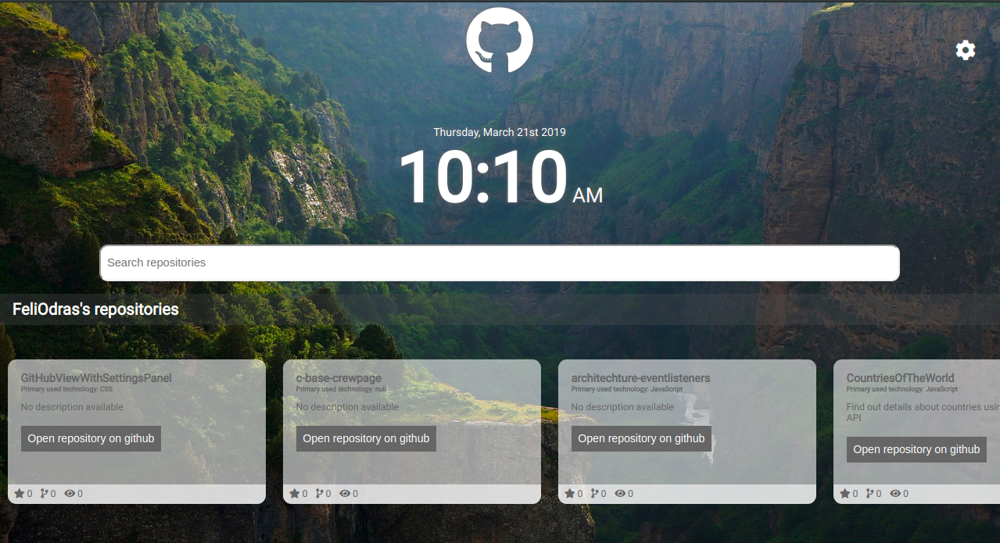
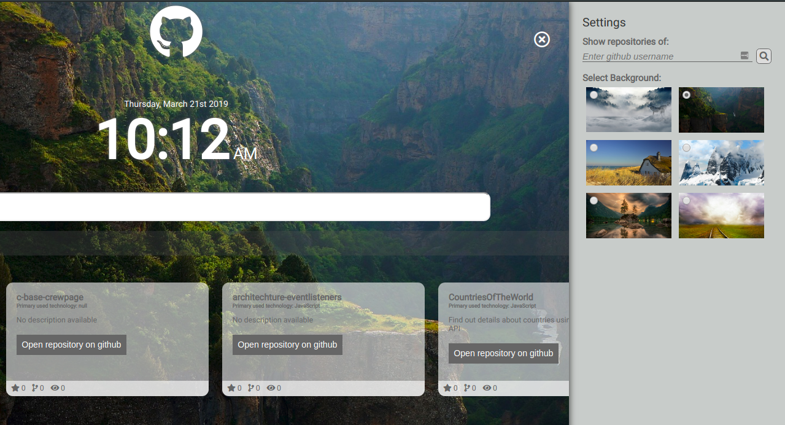

# Github View with Settings Panel

_JavaScript project using GitHub Api to display and filter GitHub Repositories_

## Preview

## Features
- Sliding settings panel
- Change user name
- Change background image
- Local Storage

## Technologies
- JavaScript
- HTML/CSS/SCSS
- moment.js Library

